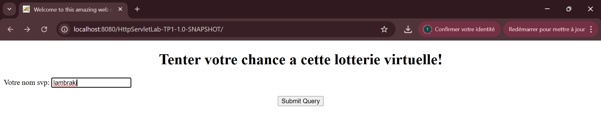
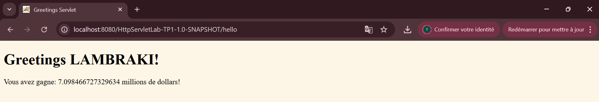

# TP1 — Servlets HTTP (Tomcat 9, `javax.servlet.*`)

This is a minimal project to implement **`GreetingServlet`** and a **`greetings.html`** form as required by TP1.

> Works with **JDK 21** by compiling the app for **Java 11** (or 8). Uses **Tomcat 9** to keep `javax.servlet.*`.

---

## 1) Prerequisites

- JDK 11+ (tested with JDK 21; compile target set to 11)
- Maven 3.x
- Tomcat **9.0.x**
- IntelliJ IDEA (Ultimate recommended; Community works with external Tomcat)

Verify:
```bash
java -version
mvn -v
```

---

## 2) Project Structure

```
HttpServletLab-TP1/
├─ pom.xml
├─ src/
│  └─ main/
│     ├─ java/
│     │  └─ exple1/
│     │     └─ GreetingServlet.java
│     └─ webapp/
│        ├─ greetings.html
│        └─ WEB-INF/
│           └─ web.xml
└─ docs/
   └─ screenshots/   # execution screenshots are here
```

---

## 3) Key Files

### `pom.xml` (WAR packaging + Servlet API provided)


### `greetings.html`

### `GreetingServlet.java`


### `web.xml`


---

## 4) Build & Run

### IntelliJ Ultimate (Tomcat Local)
1. **Artifacts** → add *Web Application: Exploded* for this module.
2. **Run/Debug Configurations** → **Tomcat Server → Local**:
    - Application server: point to Tomcat **9**.
    - Deployment: add the *war exploded* artifact.
    - Application context: `/` (optional but convenient).
3. **Run**. IntelliJ will open `http://localhost:8080/`.


Open:
- If deployed as `ROOT.war`: `http://localhost:8080/`
- Otherwise: `http://localhost:8080/HttpServletLab-TP1-1.0-SNAPSHOT/`

---

## 5) How to Test

1. Open the app URL → **`greetings.html`** should load.
2. Enter a name → **Submit** → should hit **`/hello`** (POST → handled by doGet).
3. See a greeting and a random “lottery” value.

---

## 6) Screenshots


1. **App home page** (`greetings.html`):  
   


2. **Servlet response** (`/hello`):  
   


---


