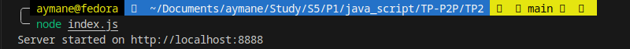
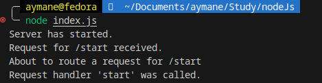
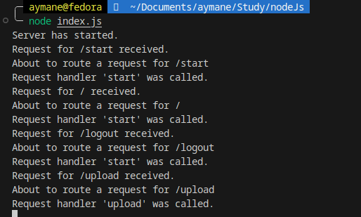
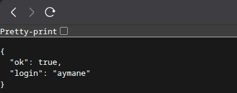
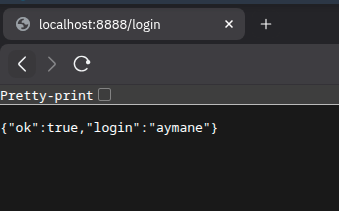

# TP P2P Web (Node.js) — README


---

## Prérequis

- Node.js ≥ 18 (LTS recommandé)
- Terminal (IntelliJ ou autre)
- À la racine du projet :
  ```bash
  npm init -y


## Étape 1 — Serveur minimal “Hello World”


## Étape 2 — Modulariser (server + index)




## Étape 3 — Router


## Étape 4 — Handlers


## Étape 5 — Réponse synchrone (anti-pattern) 
une petite remarque , j'ai fait appelé "localhost/start/" au lieu  "localhost/start " , c'est pourquoi j'ai des erreurs, ensuite j'ai réglé cette erreur mais j'ai oublié de prendre des screenshots :)





## Étape 6 — Réponse asynchrone



## Les exercices à remettre
### Final Project Structure

```
.
├── index.js
├── server.js
├── router.js
├── requestHandlers.js
├── sessions.js
├── users.js
├── uploads/
├── public/
│   └── default.png
└── images/              
```





