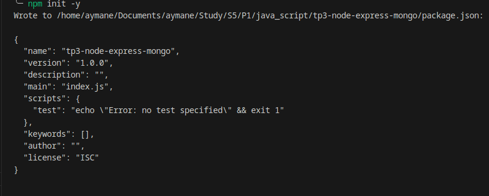
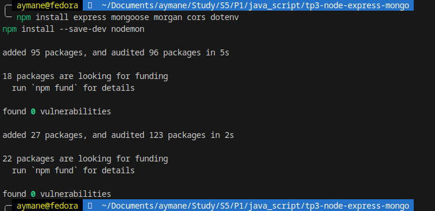
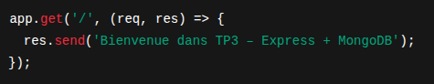
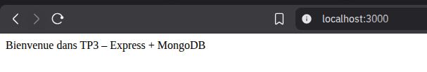
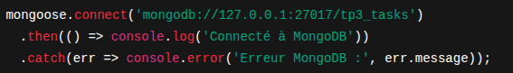
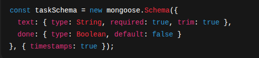
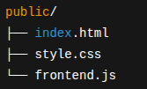
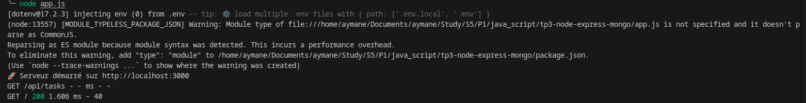
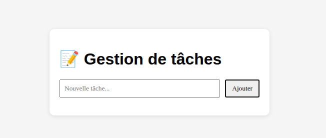

# TP3 – Express + MongoDB (Gestion de Tâches)

---

## Prérequis

- Node.js ≥ 18 (LTS recommandé)
- MongoDB (local ou Atlas)
- Terminal : VSCode 
- À la racine du projet :

  ```bash
  npm init -y
  npm install express mongoose morgan cors dotenv
  npm install --save-dev nodemon


## Structure finale du projet

.
├── app.js
├── models/
│   └── Task.js
├── routes/
│   └── tasks.js
├── public/
│   ├── index.html
│   ├── style.css
│   └── frontend.js
├── .env
├── package.json
└── images/





## Étape 1 — Serveur Express minimal

Configuration d’un serveur Express simple qui affiche un message sur la route /.




## Étape 2 — Connexion à MongoDB avec Mongoose

Mise en place de la connexion à une base locale tp3_tasks avec Mongoose :



## Étape 3 — Modèle Mongoose : Task

Création d’un modèle Task pour représenter une tâche.




## Étape 4 — Routes API REST

Création du router Express /api/tasks pour gérer les opérations CRUD :

| Méthode | URL              | Description             |
| ------- | ---------------- | ----------------------- |
| GET     | `/api/tasks`     | Liste des tâches        |
| POST    | `/api/tasks`     | Créer une tâche         |
| PUT     | `/api/tasks/:id` | Mettre à jour une tâche |
| DELETE  | `/api/tasks/:id` | Supprimer une tâche     |


## Étape 5 — Interface Front-end

L’application front-end est servie depuis le dossier public/.




## Lancer le projet


