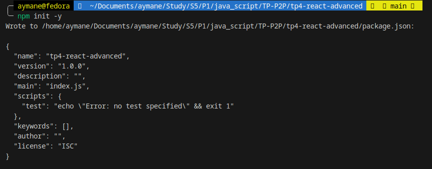
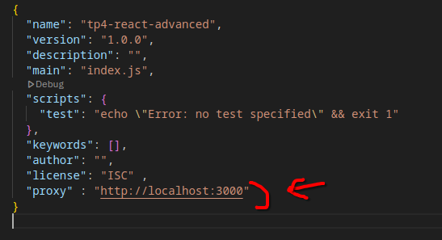
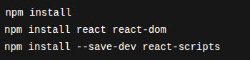
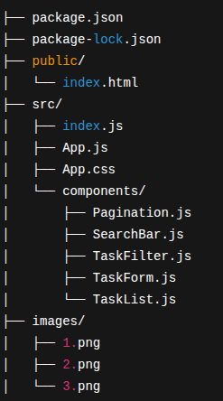
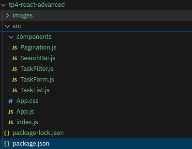
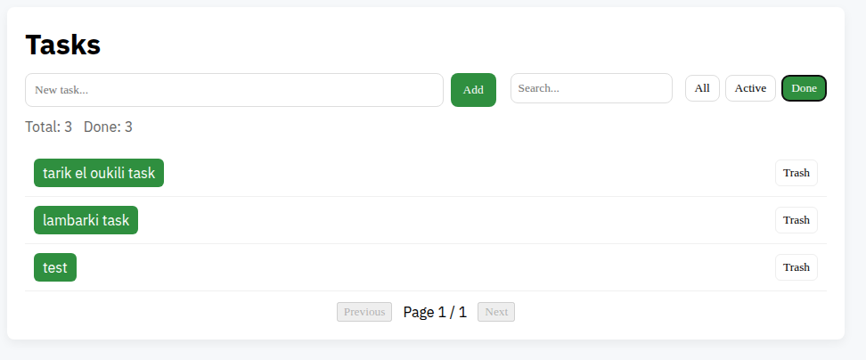
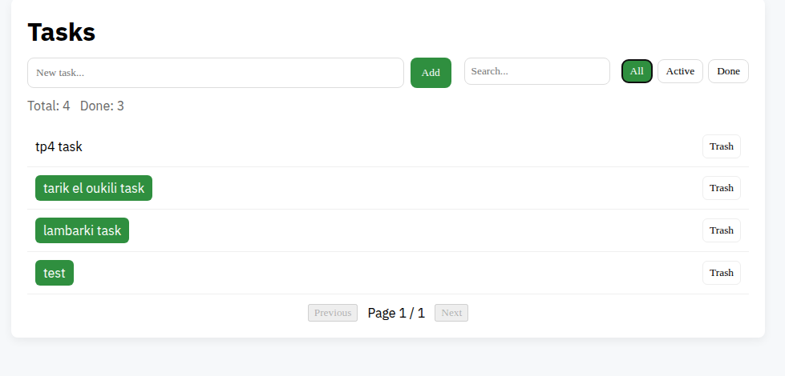

## TP4 – React Avancé (Gestion de Tâches)

----

## Prérequis

Node.js ≥ 18 (LTS recommandé)

npm

TP3 – Express + MongoDB déjà fonctionnel

Terminal : VSCode

À la racine du projet :

## Structure finale du projet : 

## Étape 2 — Structure des composants

App.js : point d’entrée, contient la logique principale.

components/TaskForm.js : formulaire pour ajouter une tâche.

components/TaskList.js : affichage de la liste des tâches.

components/TaskFilter.js : filtre par état (fait/non fait).

components/SearchBar.js : recherche par texte.

components/Pagination.js : pagination des tâches.

## Étape 3 — Communication avec l’API TP3

fetch('/api/tasks') pour récupérer les tâches

fetch('/api/tasks', { method: 'POST', body: JSON.stringify({ text }) }) pour créer

fetch('/api/tasks/:id', { method: 'PUT', body: JSON.stringify(update) }) pour mettre à jour

fetch('/api/tasks/:id', { method: 'DELETE' }) pour supprimer

## Lancer le projet  : 

